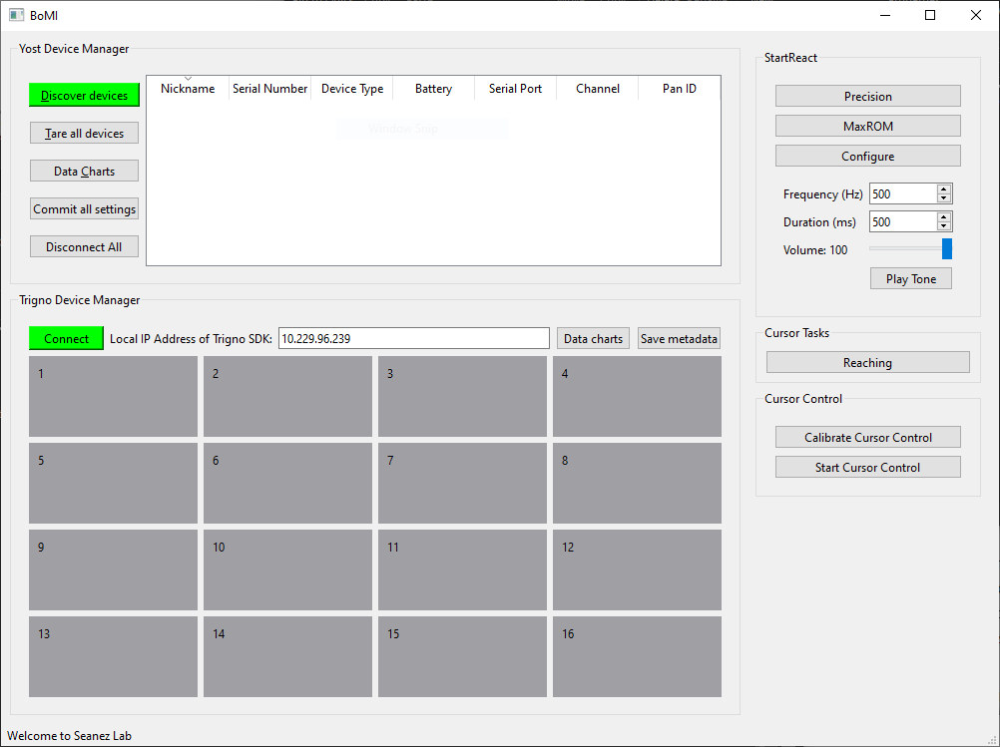

# Install BoMI

### 1. Create a virtual environment with Conda.

_**This application requires Python>=3.10**_, hence we're going to use `conda` to install a compatible version of Python. On **Windows**, use the **Anaconda Powershell Prompt**. If you don't have Anaconda or Miniconda installed, I recommend [Miniconda](https://docs.conda.io/en/latest/miniconda.html).

$ conda create -y -n bomi python==3.10

### 2. Activate the `conda` environment.

After this, you should see `(bomi)` in front of your command line prompt.

$ conda activate bomi
# (bomi) $$ 

### 3. Clone the git repo.

[Git with SSH is recommended](https://docs.github.com/en/authentication/connecting-to-github-with-ssh).

# (bomi) $$ git clone git@github.com:SeanezLab/BoMI-py.git

### 4. Install the packages with pip.

This installs 3 packages: `bomi`, `threespace_api` and `trigno_sdk`.

On Windows:

# (bomi) $$ cd BoMI-py
# (bomi) $$ python -m pip install .

On MacOS and Linux:

# (bomi) $$ cd BoMI-py
# (bomi) $$ python3 -m pip install .

### 5. Start BoMI

To test the installation of BoMI-py, run the command `bomi`.

# (bomi) $$ bomi

The BoMI window will open.

