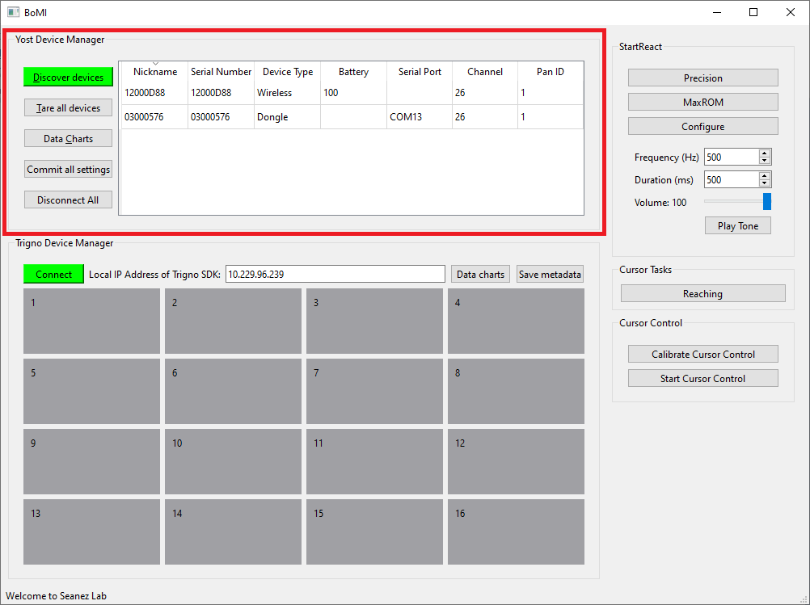
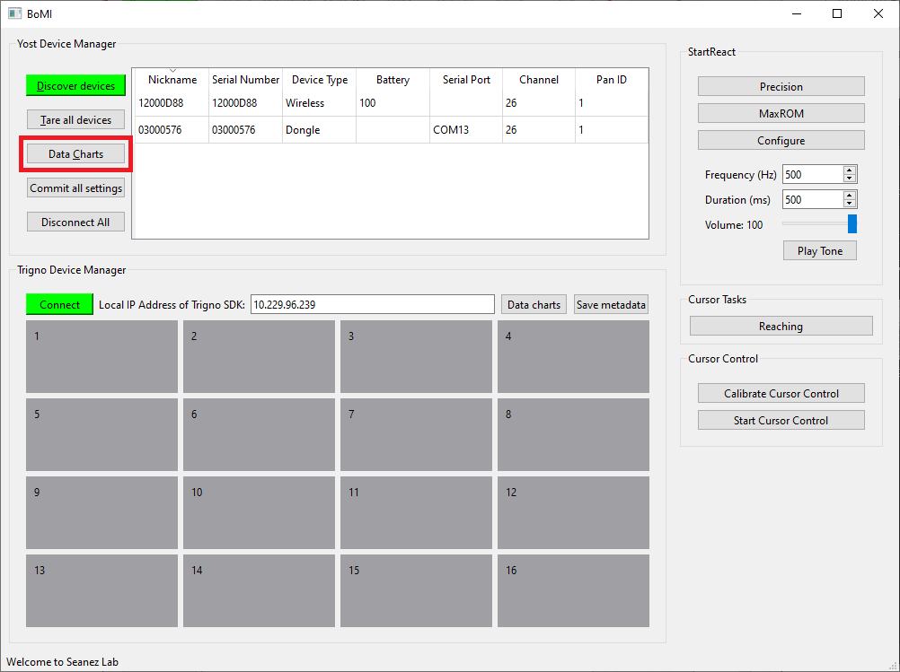
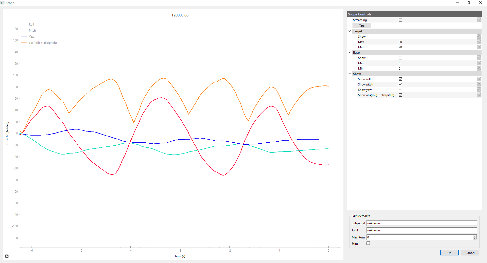
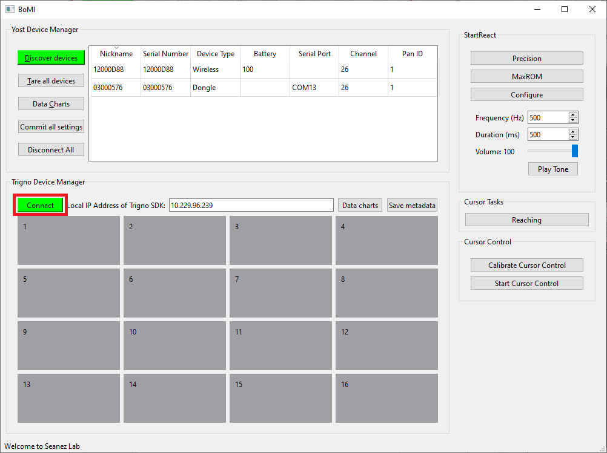
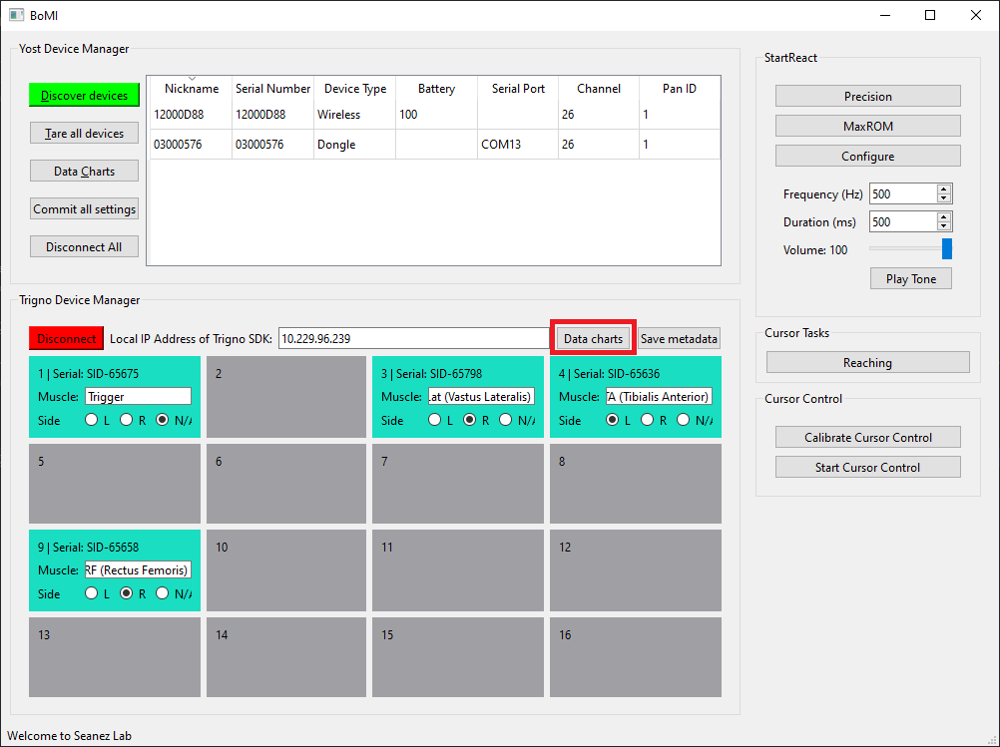
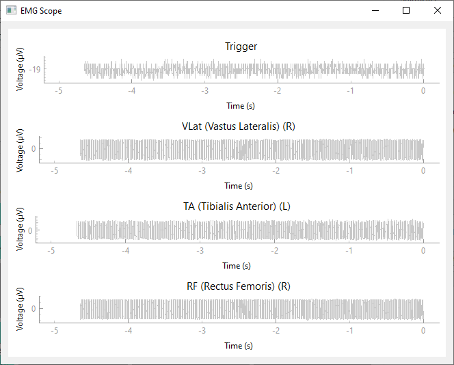
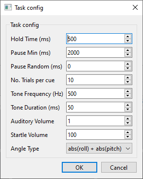
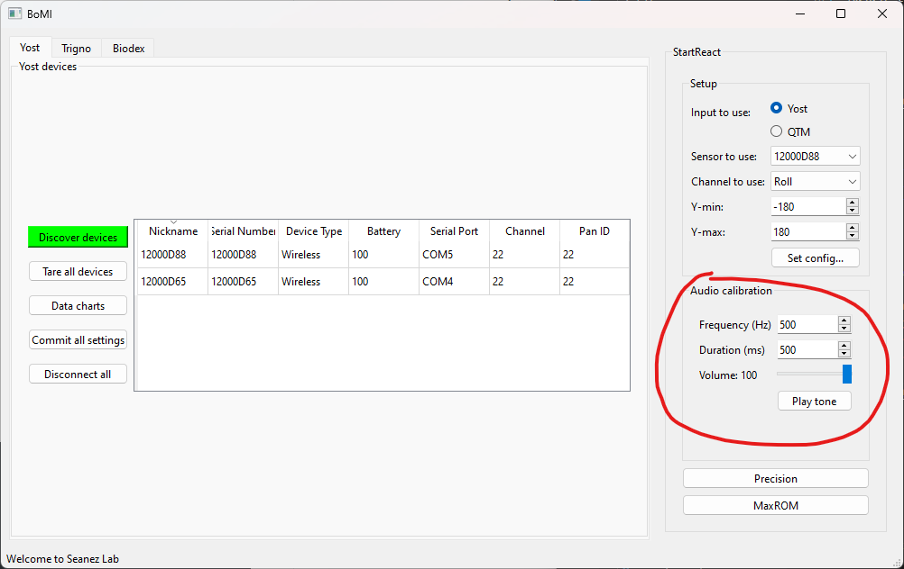
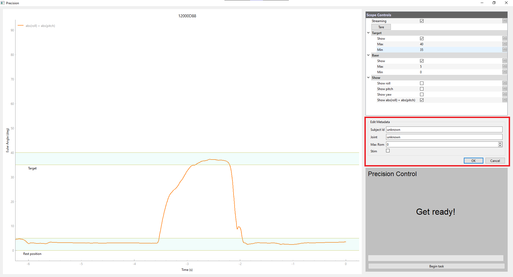
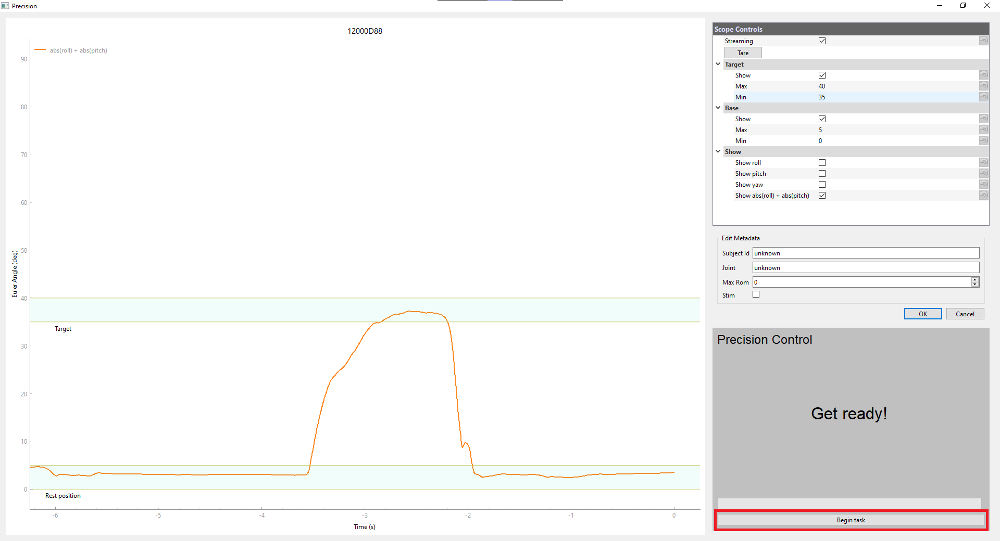

# Running a StartReact Experiment

## 1. Activate BoMI

Start BoMI by activating the conda environment where you installed [BoMI-StartReact](https://github.com/SeanezLab/BoMI-StartReact), then running `bomi` in your terminal.

<div class="termy">
```console
$ conda activate bomi
# (bomi) $$ bomi
```
</div>

The BoMI window will open.

## 2. Connect Yost 3-Space Sensors

Make sure a Yost 3-Space Sensor or a wireless Dongle paired with a wireless sensor is connected via USB to the computer. (Using a USB connection even for a wireless sensor is recommended, as it significantly improves framerate).

### a. Discover devices

Click **"Discover Devices"**. You should see the list of devices.



### b. Inspect real-time data

Click **"Data charts"** in the **Yost devices** panel  to bring up a scope and inspect the real-time data.





The chart should move as you move the sensor. If nothing shows up, try to reopen the BoMI app and reconnect the devices and the issue normally resolves.

## 3. Connect Trigno EMG Sensors

### a. Find the IP address of the Trigno SDK

Make sure the **Trigno Base Station** is connected to a computer, and the **Trigno Control Utility** (a GUI software that also acts as the Trigno SDK Server) is running on the same computer. Find the local IP address of the Trigno computer by running the following command in its Windows PowerShell:

<div class="termy">
$ ipconfig

Windows IP Configuration

Ethernet adapter Ethernet:

Connection-specific DNS Suffix . : dhcp.wustl.edu
Link-local IPv6 Address . . . . . : fe80::1817:7efc:25b9:6df%14
IPv4 Address. . . . . . . . . . . : 10.229.96.234
Subnet Mask . . . . . . . . . . . : 255.255.255.0
Default Gateway . . . . . . . . . : 10.229.96.254

</div>

Look for the _Ethernet adapter_ (preferred if the computer is connected to Ethernet) or the _Wireless LAN adaptor_. Note down the **IPv4 Address** - that's the local IP address of the computer. Make sure the Trigno computer and the BoMI computer are on the same [subnet](https://en.wikipedia.org/wiki/Subnetwork) (usually if two computers are on the same network [Wi-Fi or otherwise], they are in the same subnet). These two can be the same computer if it's convenient. The local IP address doesn't normally change, so once the machines are setup, you can use the same IP address.

### b. Connect to the Trigno SDK

Set the IPv4 address of the Trigno computer in the BoMI GUI:


Then click **"Connect"**:



Now you should see all the sensors that are paired with the Trigno Base Station. Set the _Muscle_ name and _Side_ of the sensor (each sensor must be assigned to a unique muscle and side).

### c. Inspect real-time data

Click on **"Data charts"** to open a new window to inspect the real-time data and make sure EMG placement is correct. You can change the muscle names and sides and then reopen the scope to inspect placement. The scope will automatically place different sides of the same muscle on the same row, and different muscles on different rows.




## 4. Configure StartReact

After the Yost 3-Space Sensors and Trigno EMG Sensors are setup, we can configure StartReact.

### Main experiment setup


In this panel, first select the kind of input to use with the experiment.

Then, select the sensor to use from the drop-down of available sensors.
The experiment will only show and save data from one sensor.

Then, select the channel to use from the drop-down of available channels.
The experiment will use that channel's data to determine when the participant enters the target range.
However, data from all available channels will be saved.

After the channel has been selected, the Y-min and Y-max fields
will be filled with the default values for the channel.
Adjust the fields if necessary.

#### Additional configuration

Additional configuration can be set inside **"Set config..."**.



- **Hold Time**: Amount of time one must hold inside the target to count as success.
- **Pause Min**: Minimum pause between trials.
- **Pause Random**: Max random pause to add on top of **Pause Min**.
- **No. Trials per cue**: Number of trials for each cue. Since there are three cues (visual, auditory, startling), there will be 3x this number of trials in total.

### Audio calibration



Make sure speakers to produce the auditory and startling sound effects are plugged into the computer. Test the tone by clicking on **"Play tone"**. Make sure you can achieve a ~115 dB sound with the volume at 100, and ~80 dB with the volume at 1.

## 5. Run an experiment

Finally, click on either StartReact task button to open the experiment interface.
The interface for **"Precision"** and **"MaxROM"** are basically identical;
they just configure the filename and the target range size.

- **"Precision"**: Precision matching task.
- **"MaxROM"**: Max range of motion (ROM) task.


### a. Edit Metadata

Use the **Edit Metadata** box to enter data about the subject.



- **Subject Id**: De-identified ID of the subject.
- **Joint**: Name of the joint (e.g., "Ankle L" for left ankle).
- **Max ROM**: Max ROM of the subject. Ask the subject to test their max ROM and record it here.
- **Stim**: Check this box if electrical stimulation is used for this task.

Click **"Ok"** to save the metadata to file.

### b. Begin Task

Click **"Begin task"** to start the experiment! All raw data will be stored to disk (main input, Trigno EMG, task events, metadata, and configurations etc.)


